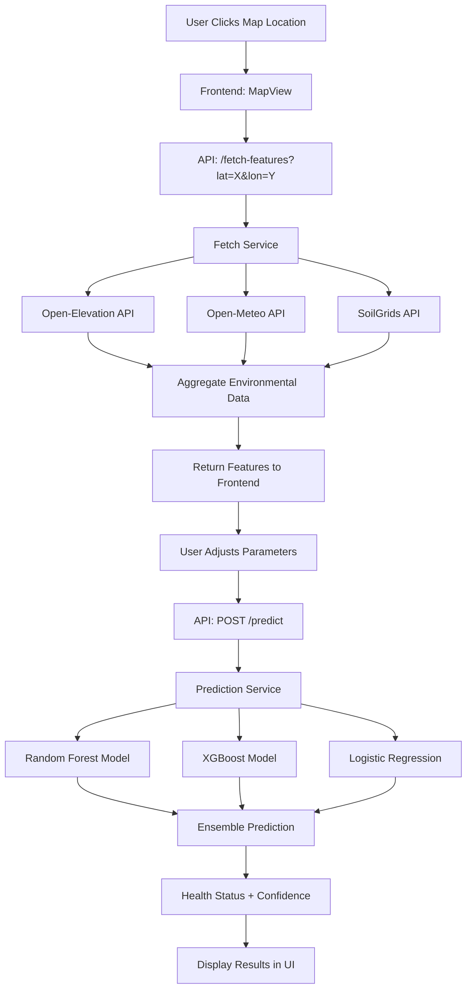
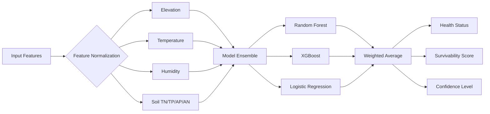

# GrowWiseAI

> AI-powered forest health prediction system using machine learning and real-time environmental data

## 🔗 Links
- Live Demo: https://growwiseai.erichuangreal.dev/

## Overview

GrowWiseAI is an intelligent environmental monitoring platform that predicts forest and tree health based on geospatial and environmental factors. By combining machine learning models with real-time data from multiple environmental APIs, the system provides actionable insights for forest conservation, land management, and ecological research.

The application features an interactive map interface where users can select any location globally to receive:
- Real-time environmental data (elevation, temperature, humidity, soil composition)
- AI-powered health predictions using ensemble ML models
- Location-specific insights with photos and descriptions
- What-if scenario analysis through adjustable environmental parameters

## Purpose

**Problem:** Forest health monitoring traditionally requires extensive field work, making it difficult to assess and predict ecosystem health at scale.

**Solution:** GrowWiseAI democratizes forest health assessment by:
- Aggregating environmental data from multiple open APIs
- Applying trained ML models (Random Forest, XGBoost, Logistic Regression) to predict health status
- Providing an intuitive interface for researchers, conservationists, and policymakers
- Enabling predictive scenarios to understand how environmental changes affect forest health

**Use Cases:**
- Conservation planning and forest management
- Environmental impact assessment
- Ecological research and education
- Early warning systems for at-risk forest areas

## Features

- **Interactive Map Interface**: Click anywhere to analyze forest health
- **Real-time Data Fetching**: Automated integration with environmental APIs
  - Elevation: Open-Elevation API
  - Weather: Open-Meteo API (temperature, humidity)
  - Soil Composition: SoilGrids API (nitrogen, phosphorus)
- **ML-Powered Predictions**: Ensemble model combining multiple algorithms
- **Adjustable Parameters**: Modify environmental factors to run "what-if" scenarios
- **Location Intelligence**: Google Places & Gemini AI for context-rich location descriptions
- **Visual Health Indicators**: Color-coded results with confidence scores

## Project Structure

```
GrowWiseAI/
├── backend/                      # FastAPI backend
│   ├── main.py                   # API routes & CORS configuration
│   ├── services/
│   │   ├── fetch.py             # Environmental data fetching logic
│   │   └── predict.py           # ML prediction service
│   ├── RandomForestModel.py     # Random Forest implementation
│   ├── XGBoostModel.py          # XGBoost implementation
│   ├── LogisticRegressionModel.py
│   └── parse_csv.py             # Data preprocessing utilities
├── frontend/                     # React + Vite frontend
│   ├── src/
│   │   ├── App.jsx              # Main application shell
│   │   ├── LandingPage.jsx      # Entry point UI
│   │   └── components/
│   │       ├── map/
│   │       │   └── MapView.jsx  # Leaflet map integration
│   │       └── panel/
│   │           ├── SidePanel.jsx      # Main control panel
│   │           ├── FeaturesPanel.jsx  # Parameter sliders
│   │           └── ResultsCard.jsx    # Prediction results display
│   └── package.json
├── scripts/                      # Deployment & service scripts
│   ├── deploy.sh                # Complete deployment script
│   ├── setup-services.sh        # System service setup
│   ├── growwiseai-*.service     # Systemd service files
│   ├── SERVICE-MANAGEMENT.md    # Service management guide
│   └── README.md                # Scripts documentation
├── requirements.txt              # Python dependencies
├── googlies.env                  # API keys (Google Maps, Gemini)
├── googlies.env.example          # Template for API keys
└── README.md
```

## System Architecture

### Data Flow Diagram



### ML Model Pipeline



## Getting Started

### Prerequisites

- **Python 3.9+**
- **Node.js 18+**
- **npm or yarn**

### Quick Deploy (Recommended)

For a complete automated setup, use the deployment script:

```bash
cd /home/sean/GrowWiseAI
./scripts/deploy.sh
```

This script will:
- Check all prerequisites
- Set up Python virtual environment
- Install all dependencies
- Configure environment variables
- Optionally build for production
- Guide you through the setup process

**Skip to [Manual Setup](#manual-setup) if you prefer to do it step by step.**

---

### Manual Setup

#### Backend Setup

1. **Create and activate virtual environment:**
   ```bash
   python3 -m venv venv
   source venv/bin/activate  # On Windows: venv\Scripts\activate
   ```

2. **Install dependencies:**
   ```bash
   pip install -r requirements.txt
   ```

3. **Configure environment variables:**
   
   Copy the example file and add your API keys:
   ```bash
   cp googlies.env.example googlies.env
   # Edit googlies.env with your actual keys
   ```
   
   > **Security Note:** Never commit `googlies.env` to git. It's already in `.gitignore`.

4. **Start the backend server:**
   ```bash
   uvicorn backend.main:app --reload --port 8001
   ```
   
   Backend API runs at `http://localhost:8001`

### Frontend Setup

1. **Navigate to frontend directory:**
   ```bash
   cd frontend
   ```

2. **Install dependencies:**
   ```bash
   npm install
   ```

3. **Start the development server:**
   ```bash
   npm run dev
   ```
   
   Frontend runs at:
   - `http://localhost:5173` (local access)
   - `http://0.0.0.0:5173` (network access)
   - `http://[your-ip-address]:5173` (access from other devices)
   
   The Vite dev server automatically proxies `/api/*` requests to the backend at `http://localhost:8001`. **The backend must be running** on port 8001 for map location cards and API features to work; otherwise you'll see connection errors in the browser console.

   In **production with nginx**, the frontend is served as static files by nginx and `/api` is proxied to the backend—no port 5173; only the backend runs on 8001. See [Production with Nginx](#production-with-nginx-recommended-on-your-own-server) below.

---

### Quick Manual Start

If you've already run `./scripts/deploy.sh`, start the services with:

```bash
# Terminal 1 - Backend
source venv/bin/activate
uvicorn backend.main:app --reload --port 8001

# Terminal 2 - Frontend
cd frontend
npm run dev
```

Visit `http://localhost:5173` to use the application.

## Running as a System Service (Ubuntu)

To run GrowWiseAI as a persistent service that starts automatically on boot:

```bash
cd /home/sean/GrowWiseAI
./scripts/setup-services.sh
```

This will:
- Set up systemd services for both backend and frontend
- Enable automatic startup on system boot
- Provide options for production or development mode

For detailed service management, see [scripts/SERVICE-MANAGEMENT.md](scripts/SERVICE-MANAGEMENT.md)

Quick commands after setup:
```bash
# Check status
sudo systemctl status growwiseai-backend
sudo systemctl status growwiseai-frontend

# View logs
sudo journalctl -u growwiseai-backend -f

# Restart services
sudo systemctl restart growwiseai-backend growwiseai-frontend
```

## API Endpoints

| Method | Endpoint | Description |
|--------|----------|-------------|
| `GET` | `/api/fetch-features?lat=<float>&lon=<float>` | Fetch environmental features for coordinates |
| `POST` | `/api/predict` | Run ML prediction on feature set |
| `GET` | `/api/location-card?lat=<float>&lon=<float>` | Get location info with photos & AI description |
| `GET` | `/health` | Health check endpoint |

### Example Request

```bash
# Fetch features
curl "http://localhost:8001/api/fetch-features?lat=37.7749&lon=-122.4194"

# Predict health
curl -X POST "http://localhost:8001/api/predict" \
  -H "Content-Type: application/json" \
  -d '{"features": {"elevation": 100, "temperature": 15, "humidity": 70, "soil_tn": 0.2, "soil_tp": 0.05, "soil_ap": 0.03, "soil_an": 0.1}}'
```

## ML Model Details

### Training Data
- **Source:** [Forest Health and Ecological Diversity Dataset](https://www.kaggle.com/datasets/ziya07/forest-health-and-ecological-diversity)
- **Features (7):** Elevation, Temperature, Humidity, Soil TN/TP/AP/AN
- **Target:** Health status (unhealthy, subhealthy, healthy, very_healthy)

### Models Used
1. **Random Forest Classifier** - Ensemble of decision trees
2. **XGBoost** - Gradient boosting with regularization
3. **Logistic Regression** - Linear baseline model

### Prediction Output
```json
{
  "status": "healthy",
  "label": "healthy",
  "survivability": 0.85,
  "confidence": 0.92,
  "key_factors": ["temperature", "soil_tn"],
  "explanation": "High soil nitrogen and moderate temperature favor healthy growth",
  "probabilities": {
    "unhealthy": 0.02,
    "subhealthy": 0.06,
    "healthy": 0.72,
    "very_healthy": 0.20
  }
}
```

## Deployment

### Production with Nginx (recommended on your own server)

On a single server, run **only the backend** on port 8001 and let **nginx** serve the built frontend and proxy API requests. No frontend process on port 5173.

1. **Build the frontend once** (from project root):
   ```bash
   cd /home/sean/GrowWiseAI/frontend && npm run build
   ```

2. **Run the backend** (e.g. with systemd):
   ```bash
   ./scripts/setup-services.sh   # choose Production, then enable/start backend only if you prefer)
   # Or run manually:
   source venv/bin/activate && uvicorn backend.main:app --host 127.0.0.1 --port 8001
   ```
   Backend listens on `127.0.0.1:8001` (localhost only; nginx will proxy to it).

3. **Configure nginx** to serve the app and proxy `/api` to the backend:
   - Copy the example config: `sudo cp scripts/nginx-growwiseai.conf.example /etc/nginx/sites-available/growwiseai`
   - Edit paths/domain if needed, then: `sudo ln -s /etc/nginx/sites-available/growwiseai /etc/nginx/sites-enabled/` and `sudo nginx -t && sudo systemctl reload nginx`

Users hit nginx on port 80 (or 443 with SSL). Nginx serves static files from `frontend/dist` and forwards `/api/*` to `http://127.0.0.1:8001`. The frontend uses relative `/api/...` URLs, so no extra env vars are needed.

### Backend (Vercel/Railway/Render)

**Option 1: Vercel**
```bash
# Install Vercel CLI
npm i -g vercel

# Deploy from project root
vercel --prod
```

**Option 2: Railway**
- Connect GitHub repo
- Set build command: `pip install -r requirements.txt`
- Set start command: `uvicorn backend.main:app --host 0.0.0.0 --port $PORT`

### Frontend (Vercel/Netlify)

**Build Configuration:**
- Build command: `npm run build`
- Output directory: `dist`
- Framework: Vite

**Environment Variables:**
Set `VITE_API_BASE_URL` to your deployed backend URL.

### Docker Deployment (Coming Soon)

```dockerfile
# Example structure - full implementation pending
FROM python:3.11-slim
WORKDIR /app
COPY requirements.txt .
RUN pip install -r requirements.txt
COPY backend/ ./backend/
CMD ["uvicorn", "backend.main:app", "--host", "0.0.0.0"]
```

## Contributing

Contributions are welcome! Areas for improvement:
- Additional ML models (Neural Networks, Ensemble methods)
- More environmental data sources
- Historical trend analysis
- Mobile-responsive UI enhancements

## License

This project is part of a hackathon submission. License TBD.

## Acknowledgments

- **Data Source:** Kaggle Forest Health Dataset
- **APIs:** Open-Elevation, Open-Meteo, SoilGrids, Google Maps, Google Gemini
- **ML Libraries:** scikit-learn, XGBoost
- **Frontend:** React, Leaflet, Vite
